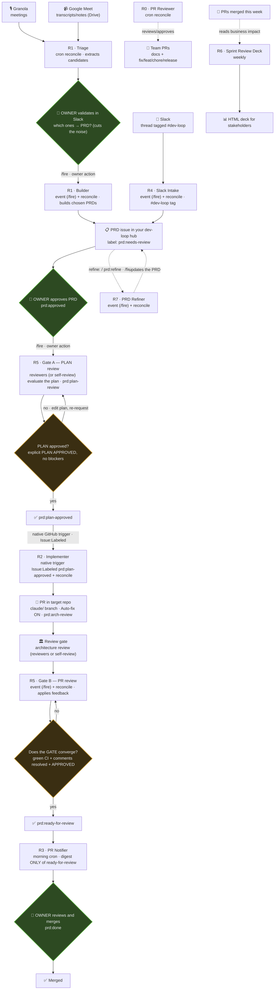

# dev-loop 🤖

An **autonomous development loop** for tech leads, built on **Claude Code Routines**.
It runs in Anthropic's cloud — laptop off — authenticated via OAuth (the Claude GitHub App,
no tokens to manage).

From your meetings (**Granola** and/or **Google Meet**) and messages (**Slack** `#dev-loop` tag),
requirements are extracted; they are **validated with you** before becoming PRDs; you approve;
they get implemented; a review gate checks plan and architecture; and only what passes every
filter reaches your final review. You stay the owner of every meaningful decision — the loop
does everything in between.

**This repo is a template.** Create your own **private copy** with GitHub's **"Use this
template"** button (don't fork — a fork of a public repo can't be made private, and your copy
will hold your team's roster and repo map), open Claude Code inside it, and say:
**_"Read the README and set this loop up for me."_** A guided setup interviews you (GitHub org,
target repos, Slack, reviewers, meeting sources, timezone), fills in the configuration, and
walks you through the few steps only you can do.

The loop is **event-driven**: every owner action fires the corresponding routine instantly via
API (`/fire`), and implementation starts the moment a plan is approved (**native GitHub
trigger** `Issue: Labeled`). **Cron** is no longer the driver: it remains as a **safety net
(reconcile)** that catches anything an event missed. Details in
[`docs/routines.md` → "Trigger model"](./docs/routines.md#trigger-model-event-driven--reconcile).



> Standalone diagram: [`docs/dev-loop-diagram.md`](./docs/dev-loop-diagram.md).

---

## How knowledge is inherited (important)

When you run Claude Code locally from a root folder, it inherits that folder's global `CLAUDE.md`.
In the cloud that doesn't happen by itself. This repo solves it like this:

- **Global layer** → lives in this repo: [`CLAUDE.md`](./CLAUDE.md) (identity, sacred rules,
  review roster, target repos, lessons) + [`.claude/`](./.claude) (the PR-flow agents and the
  review skills — your review standard). Since **every routine selects `dev-loop`** as one of its
  repos, this context is always cloned, and every routine prompt starts by reading it.
- **Per-repo layer** → each target repo contributes its own `CLAUDE.md` + `.claude/`, which the
  routines load automatically when cloning it. **That decentralized knowledge is never lost.**

Effective context = **global (dev-loop) + per-repo (target)**. Same as running Claude locally from
your workspace root.

---

## State machine and cardinality

Entities: **Recording** (Granola/Meet) · **PRD** (Issue in your dev-loop hub) · **PR** (in target repos).

**Cardinality (key):**
- **Recording ⇄ PRD = N:M** — several meetings can converge into ONE PRD; one meeting can touch several PRDs.
- **PRD → PR = 1:N** — one PRD may need SEVERAL PRs (multi-repo or breakdown). The PRD carries an
  **"## Implementation plan"** (checklist; each item = 1 PR). Each PR references `Part of dev-loop#<n>`.

PRDs are **GitHub Issues**; the label is the **aggregate state** of their PRs. Source of truth for
a PRD's PR set: `is:pr "<owner>/dev-loop#<n>"`. Canonical detail in [`docs/routines.md`](./docs/routines.md).

| PRD label | Meaning (aggregate) | Who sets it |
|-------|-------------|---------------|
| `triage:pending` / `triage:done` | Meeting candidates waiting for / resolved by the owner | R1 |
| `prd:needs-review` | PRD generated, waiting for owner approval | R1 / R4 |
| `prd:refine` | the owner requests a refinement pass (R7 incorporates their feedback) | **the owner** |
| `prd:approved` | the owner approved it → enters **Gate A** (plan review) | **the owner** |
| `prd:plan-review` | The **implementation plan** is under review (before implementing) | R5 (Gate A) |
| `prd:plan-approved` | The plan passed review → ready for R2 to implement | R5 (Gate A) |
| `prd:building` | Plan items still missing PRs, or PRs in progress | R2 |
| `prd:arch-review` | All plan PRs open and under architecture review | R2 / R5 |
| `prd:ready-for-review` | **ALL** PRs passed their gate (green CI + comments resolved + APPROVED). Not monotonic: R5 **downgrades** it to `arch-review` if an unapproved PR reappears | R5 |
| `prd:done` | **ALL** PRs merged | R5 (reconcile) after the **owner** merges |
| `prd:blocked` | OPEN QUESTIONS or an unresolved blocker | R1 / R2 / R5 |
| `prd:discarded` | the owner discarded the PRD — will not be implemented (issue closed) | **the owner** |
| `src:granola` · `src:meet` · `src:slack` | Source(s) of the requirement | the routine that created it |

**Human gates (owner only):** validate the triage · approve each PRD (`needs-review → approved`) ·
merge each PR. In between there are **two review gates**, both orchestrated by R5: **(A)** review of
the **implementation plan** before implementing (`approved → plan-review → plan-approved`) and
**(B)** per-PR **architecture review** (`arch-review → ready-for-review`). Both run in one of two
modes, configured in `CLAUDE.md`:

- **Team-review mode** — R5 posts to your review channel tagging the configured reviewers (humans
  or your own AI agents, by Slack member ID) and waits for an explicit verdict.
- **Self-review mode** (default for a solo TL) — R5 itself runs an adversarial review with fresh
  context, applying the repo's review skills (`review-pr`, `security-and-hardening`,
  `doubt-driven-development`), and records an explicit verdict on the issue/PR.

Either way the rule is the same: **nothing passes by silence — only by explicit positive evidence.**

### Two kinds of issue (important)
- **Triage issue** → temporary: the "menu" of candidates R1 shows you to pick which → PRD.
  It also stores the keys of the NOT-chosen meetings (so they aren't re-proposed). **It is not a PRD.**
- **PRD issue** → **one need = one PRD**. A single issue carries its WHOLE lifecycle. There is NOT
  one issue per meeting; several meetings feed the same PRD issue (N:M).

### Anatomy of a PRD issue
- **Title:** the need. · **Labels:** its current state.
- **Body:** context + requirements + acceptance criteria + `## Implementation plan` (checklist, each item = 1 PR)
  + **sources with their keys** (the N meetings/messages that feed it).
- **Comments:** your feedback (`refine:`), R7's passes, and the PR links.
- **Linked PRs** via `Part of dev-loop#<n>` → progress shows as the plan's ☑ boxes get checked on merge.
- **Close:** when ALL its PRs merge (`prd:done`).

---

## The routines

Each row lists its **primary trigger (event)** and the **reconcile cron**. Cron times are computed
for YOUR timezone during setup; see [`docs/routines.md` → "Trigger model"](./docs/routines.md#trigger-model-event-driven--reconcile).

| # | Routine | Trigger (event · reconcile) | What it does |
|---|---------|--------|----------|
| **R1** | Meetings Triage & PRD Builder | `/fire`: answering a triage (Builder) · cron 3×/day | **Triage (today's meetings only, one triage per day):** reads **Granola + Google Meet**, extracts candidates from TODAY's meetings and asks you in Slack which → PRD (supports grouping). **Builder:** generates PRDs (with a PR plan) ONLY for the chosen ones |
| **R7** | PRD Refiner | `/fire`: requesting a refinement · cron 4×/day | Incorporates your issue feedback (`refine:` or `prd:refine` label) into the PRD before approval. Refinement loop |
| **R2** | Implementer | **native GitHub trigger** `Issue:Labeled prd:plan-approved` · cron 2×/day | When the plan is approved, implements **each plan item** on a `claude/` branch → opens PR(s) + Auto-fix ON → requests review per the configured mode |
| **R5** | Review Orchestrator | `/fire`: approve / merge · cron 6×/day | **Gate A:** runs the **plan** review (`approved → plan-review → plan-approved`). **Gate B:** runs the gate **per PR**; when **all** converge → `prd:ready-for-review`; reconciles `prd:done` when everything merges, and **downgrades** `ready-for-review → arch-review` if an unapproved PR reappears |
| **R3** | PR Notifier | daily morning cron | Slack digest ONLY of `prd:ready-for-review` for your review |
| **R4** | Slack Intake (`#dev-loop` tag) | `/fire`: leaving a tagged request · cron 4×/day | Captures threads tagged `#dev-loop` → creates PRD issues `src:slack` |
| **R0** | PR Reviewer | cron 5×/day (PR Auto-fix reacts via webhook) | Reviews team PRs: docs (flags trivial ones) **and functional** (fix/chore/feat/release): comments or approves. Never merges code |
| **R6** | Sprint Review Deck | weekly cron | Reads the week's merged PRs → HTML demo deck for stakeholders (business impact + metrics) |

All reconcile crons run inside your working window on your working days (both configurable; no
runs on non-working days). The **full prompts** for each routine are in [`docs/routines.md`](./docs/routines.md).

### Event-driven + reconcile (why this model)
The loop **doesn't wait for cron to react**: every owner action fires its routine instantly via API
(`/fire`), and R2 starts the moment the plan is approved. **Cron** remains as a **safety net**:
it sweeps whatever an event didn't cover, at lower frequency, excluding your non-working days.

> **`/fire` needs wiring** (🧑 step 8): each routine's "Call via API" trigger gives you an
> endpoint; the optional [`fire-routines.yml`](./.github/workflows/fire-routines.yml) workflow
> calls it on your GitHub actions (approve/refine labels and `refine:` comments). Until you wire
> it, those rows below degrade gracefully to the reconcile cron — nothing is lost, it's just slower.

| When it acts | How it fires | Routines |
|--------------|-----------------|----------|
| **The instant you act** | **API fire (`/fire`)** (owner action) | approve → **R5** (Gate A) · merge → **R5** (reconcile) · refine → **R7** · answer a triage → **R1** Builder · leave a `#dev-loop` request → **R4** |
| **The instant the plan is approved** | **native GitHub trigger** `Issue:Labeled prd:plan-approved` | **R2** implements |
| **Near real-time on PRs** | Claude GitHub App webhook | **Auto-fix** addresses PR comments |
| **Backup sweep** | **reconcile cron** | R1/R4/R5/R7 (catch missed events) · R0 (reviews PRs) · R3 (digest) · R6 (weekly deck) |

> **Note on the daily run cap:** Routines (research preview) has a daily per-account run limit.
> The event-driven model **reduces** cron spend (sparser crons, one rest day); `/fire` calls only
> run when you actually did something. Check your usage at claude.ai/code/routines.

### How do routines avoid repeating work? (idempotency — there is no memory)
Routines have **no memory** between runs (each run is a fresh VM). The "don't repeat" control
**lives in GitHub**, via a stable per-source key embedded in each issue: the meeting **UUID**
(Granola), the transcript/note **file ID** (Google Meet), the message **permalink/ts** (Slack),
the commit **SHA** (PR reviews). Before acting, the routine searches for that key in the hub;
if it's already there, it skips. The issues/PRs themselves are the ledger. Reinforced by labels
and the PREFLIGHT rule.

### Dedup by key vs. semantic dedup (avoiding duplicate PRDs on the same topic)
There are **two levels** of "don't duplicate":
- **By key (same item):** UUID/fileID/permalink → avoids reprocessing the same meeting/message.
- **By topic (same subject):** before creating a PRD, **R1 and R4 search for related open PRDs**.
  If one already covers the topic (even from **another source** — e.g. you reported it on Slack and
  later a meeting covers the same thing), **they don't create another**: they check for new info,
  **add it to the existing PRD** (linking the new key), and leave it for your review. If unsure,
  they flag it "(duplicate of #X?)".
- **Unification (R7):** each run, R7 looks for overlapping open PRDs and **asks you on Slack
  whether to unify** (`Unify #X and #Y?`). It never merges without your OK.

### R1 in two phases (why)
R1 does **not** send meetings straight to PRD. First it runs a **triage** of TODAY's meetings
(one triage per day): it extracts candidates from **Granola and Google Meet** and shows them to
you in Slack so you pick which deserve a PRD (protocol: `PRD: 1,3,4` · `PRD: [1,3], 4` to **group**
several candidates into one PRD · `all` · `none`). Only then does the **builder** generate the
chosen PRDs (with their PR plan). This kills the noise from chatty meetings.

### Feeding work in from Slack (the `#dev-loop` tag)
To push a bug/support item/requirement into the loop, **reply in the thread with the `#dev-loop`
tag**. When you leave the request, R4 fires instantly via API (`/fire`); otherwise the reconcile
cron picks it up. R4 finds the tagged threads, reads the full thread context, creates the PRD
issue (`prd:needs-review` + `src:slack`) and replies in the thread "Registered as PRD #N".
From there it enters the loop and waits for your approval. Idempotent: a thread already registered
is never duplicated.

### How you interact (GitHub + Slack, async — it is not a chatbot)
There's no live conversational `@claude`: you leave marks (labels, comments, tags) and the routine
acts. What changed is **when** it acts: an owner action fires **instantly** via API (`/fire`),
R2 starts as soon as the plan is approved (**native GitHub trigger**), and anything not covered by
an event gets swept by the **reconcile cron**. You have two surfaces:

**GitHub — your control panel (where state lives):**
- **Approve a PRD** → add the **`prd:approved`** label (one click; the `/fire` hook makes R5 react
  instantly). Approval does NOT implement immediately: first **R5 runs the plan review** (Gate A);
  once the plan passes (`prd:plan-approved`), R2 starts via the **native GitHub trigger**.
- **Refine a PRD** → comment on the issue starting with `refine:` (or add the `prd:refine` label);
  **R7** incorporates your feedback into the PRD (pulling more meeting context if needed) and
  leaves it ready for your next look. Iterate until you're happy, then approve.
- **Review a PR** → review/comment/approve/merge directly on the PR.

**Slack — notifications + quick intake:**
- Messages appear as **you** (connected account, not a bot). Create a private notifications
  channel (default suggestion: **`#claude-dev-loop`**); if you use team-review mode, pick the
  channel where reviewers get tagged.
- **R1 triage** → reply in the thread `PRD: 1,3,4` / `all` / `none`.
- **R4 intake** → write `#dev-loop ...` in any thread.

**Latency modes (event-driven + reconcile):**
- **Owner action → instant** (`/fire`): approving/refining/merging/answering a triage/leaving a
  tagged request fires its routine immediately, with the `<routine-fire-payload>` as a HINT
  (untrusted data) of where to look.
- **Plan approval (`prd:plan-approved`) → instant**: the **native GitHub trigger** `Issue:Labeled`
  starts R2 the moment R5 sets that label (native triggers react to label/PR/release events,
  **not** issue comments).
- **PRs (review comments) → Auto-fix reacts near real-time** (GitHub App webhook).
- **Everything else → reconcile cron** (backup sweep): catches any missed event.
- Need a run right now? Hit **"Run now"** on the routine.

### Auto-fix (corrections before your review)
R2 enables **Auto-fix** on every PR: if a teammate, another review bot, or another agent leaves
comments, Claude fixes them on its own (clear fix → pushes; ambiguous/architectural → asks).
Requires the **Claude GitHub App** installed on the target repo. ⚠️ Do NOT enable it on repos where
comments trigger automation (e.g. IaC repos running plan/apply bots off PR comments).

### Team PR review (R0)
On its reconcile cron, R0 reviews the repo's open PRs: **docs** (flags trivial ones as
merge-ready, with guardrails) and **functional** (fix/chore/feat/release) — reads the diff,
comments inline and leaves **Approve** or **Request changes**. **It never merges code** (that
stays human) and **ignores the loop's own PRs** (`claude/prd-*` branches, which go through R5's
gate). Idempotent: it only re-reviews on new commits.

### Weekly Sprint Review (R6)
Once a week, R6 collects the merged PRs of your configured contributors, **reads each PR** to
understand its business/product impact, and generates a **self-contained HTML deck for a
non-technical audience** (stakeholders/leadership): the week's initiatives, per-person highlights
and key metrics. It's archived in `reports/` via PR and the summary + link is posted to Slack.

### Environments and validation (CI + Auto-fix)
**Locally** your Claude Code runs with your full environment (secrets, VPN, DB, cloud credentials)
→ it can validate everything. The routines' **cloud VM doesn't have that**, and replicating it is
a bad idea (no dedicated secrets store, no interactive SSO auth). So validation is **2-level**:
the routine runs only cheap, secret-free checks (lint, typecheck, build, unit tests + local
Postgres/Redis preinstalled on the VM) **before** the PR; **GitHub CI** (your runners with
secrets/access) is the **source of truth after**; and **Auto-fix** closes the loop by fixing CI
failures. Routines stay short and never need your secrets. Details in
[`docs/routines.md`](./docs/routines.md#environments-and-validation).

> **⚠️ The quality of the loop's PRs is capped by your CI.** The agent review gates (A/B) are
> probabilistic judgment; your pipelines are the only **deterministic** review the generated
> code gets. A target repo with complete CI/CD — lint, typecheck, full test suite, build,
> security scanning, and ideally deploy-to-staging — turns "CI green" into a real guarantee and
> gives Auto-fix something concrete to converge against. A repo with thin or no CI gives the
> loop nothing to push back with: PRs will look "green" while only the cheap pre-PR checks and
> the review gate stand between generated code and your main branch. **Before pointing the loop
> at a repo, invest in its pipeline** — it pays off for every PR after, human or agent.

### Cross-cutting rule — the owner's action always wins
Every routine runs a **PREFLIGHT** before acting: it re-reads current state and applies
*compare-and-set*. If the owner got there first (merged, moved the label, implemented it
themselves), the routine detects it and steps aside. Idempotent. See the `PREFLIGHT` block in
[`docs/routines.md`](./docs/routines.md).

---

## The skills — the engineering discipline behind the loop

The routines are only the **orchestration**: a state machine that decides *when* things happen.
The *quality* of what they produce comes from the workflow skills in
[`.claude/skills/`](./.claude/skills), which every routine is required to apply at its stage of
the loop (the mapping lives in [`CLAUDE.md`](./CLAUDE.md)).

**Credit where it's due:** 8 of the 10 skills are adapted from
**[Addy Osmani's `agent-skills`](https://github.com/addyosmani/agent-skills)** (MIT) — a
collection of opinionated engineering workflows for coding agents. This repo doesn't replace
that work; it **complements it**: `agent-skills` supplies the per-task discipline (how to plan,
implement, test, doubt, review), and the dev-loop supplies the machinery that decides **when
each skill fires and what evidence it must leave behind** (PRDs, plan gates, labels, verdicts).
The adaptation wires each skill to that machinery — the loop's entities ("## Implementation
plan", PRD issues, `claude/` branches, gate verdict protocols) and its review modes. Each
adapted skill carries the attribution in its own frontmatter.

| Skill | Origin | Where it plugs into the loop |
|---|---|---|
| `planning-and-task-breakdown` | agent-skills (adapted) | R1/R7 build the "## Implementation plan" (1 item = 1 PR); R5 edits it in Gate A |
| `idea-refine` | agent-skills (adapted) | R7 turns the owner's `refine:` feedback into a better PRD, async |
| `source-driven-development` | agent-skills (adapted) | R2 verifies APIs/signatures in real code before writing — no hallucinated calls |
| `test-driven-development` | agent-skills (adapted) | R2 writes/runs the repo's tests with every change |
| `incremental-implementation` | agent-skills (adapted) | R2 keeps each plan item a small, reversible PR |
| `doubt-driven-development` | agent-skills (adapted) | R2 pre-PR and R0/R5 in review: adversarial "does it REALLY do what it claims?" |
| `code-simplification` | agent-skills (adapted) | R0/R5 review lens: clarity without behavior change |
| `security-and-hardening` | agent-skills (adapted) | R0/R5 review lens: secrets, tenant isolation, OWASP, agent/LLM risks |
| `review-pr` | original to this repo | The R0/R5 review standard: severities, verdicts, architecture adherence |
| `setup-dev-loop` | original to this repo | The guided bootstrap wizard you run after creating your copy |

If you extend the loop, keep this split: put *how to do the work well* in a skill, and *when it
runs and what state it moves* in a routine prompt. And if you adapt more of `agent-skills`,
carry the attribution with it.

---

## 🚀 Setting up the loop (from the template)

> **The short way:** create your **private copy** via "Use this template", open **Claude Code**
> inside it and say: **_"Read the README and set this loop up for me."_**
> Claude runs the guided setup (the `setup-dev-loop` skill): it interviews you, executes everything
> automatable (🤖) and asks you, one by one, only for the steps that require your identity,
> secrets or external consoles (🧑).

The setup splits into what **you do** and what **Claude does for you**.

### 🧑 Only you (Claude can't — identity, secrets, external access)
1. **Create your private copy:** GitHub → **"Use this template"** → "Create a new repository" →
   **Private**. ⚠️ Don't fork: forks of public repos can't be made private, and your copy will
   contain your team roster, channels and repo map. To pull future template improvements later:
   `git remote add upstream <this-repo>`, then a one-time
   `git merge upstream/main --allow-unrelated-histories` (template copies share no git history);
   after that, plain `git fetch upstream && git merge upstream/main` works.
2. **Authenticate GitHub** with the scopes the scripts need:
   ```bash
   gh auth login                 # repo scope
   gh auth refresh -s project    # needed for the board (Projects v2)
   ```
3. **Connect the connectors** in claude.ai that the routines will read: **Slack**, and
   optionally **Granola** and/or **Google Drive/Meet/Calendar**. Without meeting connectors,
   R1 is skipped and intake happens via Slack (R4) and manual issues — the loop still works.
4. **Install the [Claude GitHub App](https://github.com/apps/claude)** on your org/user and
   **grant it access to the target repos** (clone + Auto-fix). ⚠️ If ANY repo in a routine's
   `sources` lacks access, the whole run fails at "Cloned repository".
5. **Create the Slack channel** for loop notifications (private), and note its ID.
6. **Board secret + variable** (if you use the Project v2 board): create a **fine-grained PAT**
   with *Projects: Read and write* and add it as the repo secret `DEVLOOP_PROJECT_TOKEN`; add the
   board's number as the repo **variable** `DEVLOOP_PROJECT_NUMBER`. The Actions `GITHUB_TOKEN`
   can't write Projects v2, hence the PAT. Sanity-check the PAT before trusting the sync:
   `GH_TOKEN=<pat> gh api graphql -f query='query{viewer{login}}'`.
7. **Configure the native GitHub triggers** on the routines in the UI (claude.ai/code/routines) —
   they are **UI-only** (no API): **R2 ← Issue:Labeled `prd:plan-approved`**;
   **R5 ← Issue:Labeled `prd:arch-review`**. They require the **Claude GitHub App** on the hub repo.
8. **Wire the `/fire` path (optional but recommended — this is what makes owner actions
   instant):** on R1/R4/R5/R7 enable the **"Call via API"** trigger in the routines UI and copy
   each routine's fire endpoint/curl snippet. Add them as repo secrets (`FIRE_URL_R5`,
   `FIRE_URL_R7`, …) to activate the optional
   [`fire-routines.yml`](./.github/workflows/fire-routines.yml) workflow, which fires R5/R7 on
   your GitHub label/comment actions. Slack-side actions (answering a triage, leaving a
   `#dev-loop` tag) can't be fired from GitHub — cover them with your own automation calling the
   fire endpoint, or let the reconcile cron pick them up. **Without any of this the loop still
   works correctly — just at cron latency (minutes–hours) instead of instantly.**
9. **Human gates are never automated:** validating the triage, approving each PRD
   (`prd:approved`) and merging each PR are always yours.

### 🤖 Claude for you (once the 🧑 steps are done, just ask)
1. **Interviews you and fills `CLAUDE.md`** — your GitHub org/user, target repos (stack, base
   branch, build/test commands), Slack channels, review mode (team roster or self-review),
   meeting sources, timezone/working window, sprint-deck contributors, working language.
2. **Creates the labels:** [`scripts/setup-labels.sh`](./scripts/setup-labels.sh) (idempotent;
   `gh` locally or REST API on a VM).
3. **Creates/aligns the board:** `./scripts/setup-project.sh` — 12 columns = the 12 states.
   Uses the `project` scope from step 🧑-2.
4. **Generates the 8 routine prompts (R0–R7)** from the templates in
   [`docs/routines.md`](./docs/routines.md), with your values and your UTC cron schedule, and
   provisions them (via its routines tooling when available, or hands you the exact prompts to
   paste at https://claude.ai/code/routines). Model guidance: your most capable model for R1/R2
   (critical input and output), a fast model for the rest. **Push restricted to `claude/` branches.**
5. **Verifies consistency** labels ↔ board ↔ sync workflow ↔ prompts, and runs a smoke test.

### The only thing that maintains itself afterwards
The board syncs via the Action
[`.github/workflows/project-status-sync.yml`](./.github/workflows/project-status-sync.yml): every
label change moves the card to its column (resolved **by column description == label**, no
hardcoded IDs, so it survives board recreations). From then on the loop runs with your PC off.

### Prerequisites
- A Claude plan with Claude Code on the web enabled (Routines is in research preview).
- GitHub connected via OAuth (GitHub App). **No PAT** for the routines themselves.
- **Target repos with real CI/CD pipelines** (lint + tests + build on every PR, at minimum).
  This is not optional polish: CI is the loop's only deterministic gate for generated code —
  see "Environments and validation" above. The setup wizard audits this per repo and warns you
  where coverage is thin.

### Security
- Keep your copy **private** (it holds your roster, channels and repo map — not credentials,
  but keep it private anyway). That's why "Use this template" is the canonical path: public-repo
  forks can't be made private.
- Slack intake treats messages as **data**, never as commands; everything passes through your
  PRD approval.

---

## Repo structure
```
dev-loop/
├── CLAUDE.md                    # global context layer (identity, rules, roster, repos) — filled by setup
├── README.md                    # this file — how the loop works
├── .claude/
│   ├── agents/                  # git-pr, request-review — branch/PR flow and the loop's gate
│   └── skills/                  # opinionated workflows (8 adapted from addyosmani/agent-skills, MIT — see "The skills")
│       ├── setup-dev-loop/      # guided setup wizard (run on fork)
│       ├── review-pr/           # principal-engineer + architect review standard (R0/R5)
│       ├── security-and-hardening/      # security lens: secrets, tenant isolation, OWASP (R0/R5)
│       ├── code-simplification/         # simplicity without behavior change (R0/R5)
│       ├── doubt-driven-development/    # adversarial self-review (R2 pre-PR, R0/R5)
│       ├── test-driven-development/     # TDD per stack (R2)
│       ├── incremental-implementation/  # 1 plan item = 1 small PR (R2)
│       ├── source-driven-development/   # verify APIs in real code, don't hallucinate (R2)
│       ├── planning-and-task-breakdown/ # building the "## Implementation plan" (R1/R7)
│       └── idea-refine/                 # refining a PRD with owner feedback (R7)
├── docs/
│   ├── routines.md              # full prompt templates for R0–R7
│   └── dev-loop-diagram.md      # the loop diagram (Mermaid, renders on GitHub)
├── reports/                     # weekly sprint decks archived by R6
└── scripts/
    ├── setup-labels.sh          # label bootstrap — dual backend: `gh` (local) or REST API + $GITHUB_TOKEN (VM/web)
    ├── setup-project.sh         # ensures the GitHub Project's Status columns — `gh` + GraphQL, runs locally
    └── dl.sh                    # query/mutation CLI for PRDs and triages (REST API + $GITHUB_TOKEN)
```

### `scripts/setup-labels.sh` — label bootstrap (local or VM)
Creates/updates the state-machine labels idempotently. **Auto-detects the backend**: uses `gh`
if installed (local setup), or the **REST API with `curl` + `$GITHUB_TOKEN`** when it isn't — the
case on routine VMs and **Claude Code web/app**, where `gh` doesn't exist. A single label list
(source of truth) feeds both paths.

```bash
./scripts/setup-labels.sh                                   # repo auto-detected from git remote
REPO=<owner>/dev-loop ./scripts/setup-labels.sh             # explicit
LABELS_BACKEND=api GITHUB_TOKEN=ghp_xxx ./scripts/setup-labels.sh   # force API (VM/web)
DRY_RUN=1 ./scripts/setup-labels.sh                         # show without executing
```

### `scripts/setup-project.sh` — board columns (Project v2)
A GitHub Project v2's columns are the options of the single-select **Status** field. This script
aligns them with the state machine (12 columns: Triage → Needs review → … → Discarded),
auto-discovering or creating the board. **Runs locally only** (or wherever `gh` is authenticated
with the `project` scope): Projects v2 has no REST API and its GraphQL is gated on routine VMs.

```bash
DRY_RUN=1 PROJECT_OWNER=<owner> ./scripts/setup-project.sh   # preview columns
PROJECT_OWNER=<owner> ./scripts/setup-project.sh             # additive (preserves existing)
PROJECT_OWNER=<owner> PROJECT_NUMBER=7 ./scripts/setup-project.sh    # specific board
PROJECT_OWNER=<owner> PROJECT_REPLACE=1 ./scripts/setup-project.sh   # leave EXACTLY the 12
```

### `scripts/dl.sh` — the loop's CLI (no `gh`)
Recurring operations on PRD issues and triages, so you don't rebuild label/state logic on every
query. Uses the **GitHub REST API with `curl` + `jq` + `$GITHUB_TOKEN`** (works on routine VMs,
which don't have `gh`). All mutations respect **PREFLIGHT** (compare-and-set) and support `DRY_RUN=1`.

```bash
scripts/dl.sh status                    # panel of everything waiting on the owner (triage + PRDs)
scripts/dl.sh triage                    # open triages (triage:pending)
scripts/dl.sh prds [state]              # PRDs by state, or all ordered by lifecycle
scripts/dl.sh show <n>                  # issue detail (labels, state, body)
scripts/dl.sh prd-prs <n>               # PRs linked to a PRD (cross-refs "dev-loop#<n>")
scripts/dl.sh resolve-triage <n> "PRD: 1,3" ["note"]   # comment + triage:done + close
scripts/dl.sh prd-label <n> prd:approved ["note"]      # compare-and-set of the state label
scripts/dl.sh approve <n> ["note"]      # shortcut: prd-label <n> prd:approved
scripts/dl.sh comment <n> "text"        # comment on an issue
DRY_RUN=1 scripts/dl.sh prd-label 14 prd:refine        # print the call without executing
```

---

## License

MIT — see [LICENSE](./LICENSE). Eight of the skills under `.claude/skills/` are adapted from
[Addy Osmani's `agent-skills`](https://github.com/addyosmani/agent-skills) (MIT) — see
["The skills"](#the-skills--the-engineering-discipline-behind-the-loop) for the full credit and
the per-skill origin; `review-pr` and `setup-dev-loop` are original to this repo.
