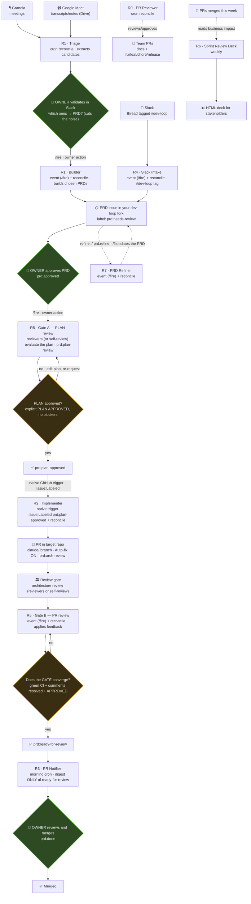

# dev-loop — loop diagram

Standalone version of the flow diagram (renders on GitHub).

```mermaid
flowchart TD
    G["🎙️ Granola<br/>meetings"] --> R1A
    M["📹 Google Meet<br/>transcripts/notes (Drive)"] --> R1A
    S["💬 Slack<br/>thread tagged #dev-loop"] --> R4

    R1A["R1 · Triage<br/>cron reconcile · extracts candidates"] --> TRIAGE
    TRIAGE{"👤 OWNER validates in Slack<br/>which ones → PRD? (cuts the noise)"}:::human -->|"/fire · owner action"| R1B
    R1B["R1 · Builder<br/>event (/fire) + reconcile · builds chosen PRDs"] --> ISSUE
    R4["R4 · Slack Intake<br/>event (/fire) + reconcile · #dev-loop tag"] --> ISSUE

    ISSUE["📋 PRD issue in your dev-loop fork<br/>label: prd:needs-review"] --> GATE1
    ISSUE -.->|"refine: / prd:refine · /fire"| R7["R7 · PRD Refiner<br/>event (/fire) + reconcile"]
    R7 -.updates the PRD.-> ISSUE
    GATE1{"👤 OWNER approves PRD<br/>prd:approved"}:::human -->|"/fire · owner action"| R5PLAN

    R5PLAN["R5 · Gate A — PLAN review<br/>reviewers (or self-review) evaluate the plan · prd:plan-review"] --> PLANGATE
    PLANGATE{"PLAN approved?<br/>explicit PLAN APPROVED, no blockers"}:::gate
    PLANGATE -->|no · edit plan, re-request| R5PLAN
    PLANGATE -->|yes| PLANOK["✅ prd:plan-approved"]
    PLANOK -->|"native GitHub trigger · Issue:Labeled"| R2

    R2["R2 · Implementer<br/>native trigger Issue:Labeled prd:plan-approved + reconcile"] --> PR
    PR["🔀 PR in target repo<br/>claude/ branch · Auto-fix ON · prd:arch-review"] --> VIT
    VIT["🏛️ Review gate<br/>architecture review (reviewers or self-review)"] --> R5
    R5["R5 · Gate B — PR review<br/>event (/fire) + reconcile · applies feedback"] --> GATECONV

    GATECONV{"Does the GATE converge?<br/>green CI + comments resolved + APPROVED"}:::gate
    GATECONV -->|no| R5
    GATECONV -->|yes| READY["✅ prd:ready-for-review"]
    READY --> R3

    R3["R3 · PR Notifier<br/>morning cron · digest ONLY of ready-for-review"] --> GATE2
    GATE2{"👤 OWNER reviews and merges<br/>prd:done"}:::human --> DONE["✅ Merged"]

    R0["R0 · PR Reviewer<br/>cron reconcile"] -.reviews/approves.-> PRTEAM["📄 Team PRs<br/>docs + fix/feat/chore/release"]

    PRWEEK["🔀 PRs merged this week"] -.reads business impact.-> R6["R6 · Sprint Review Deck<br/>weekly"]
    R6 --> DECK["📊 HTML deck for stakeholders"]

    classDef human fill:#2d4a22,stroke:#4ea832,color:#e6e8ec,stroke-width:2px;
    classDef gate fill:#3a2e12,stroke:#c99a2e,color:#e6e8ec,stroke-width:2px;
```
